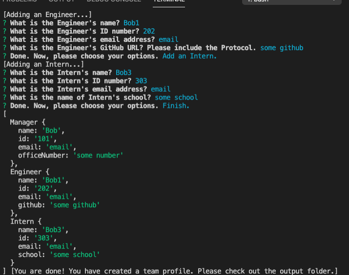

# Homework8-Team Profile Generator

**Demonstration Video**
https://drive.google.com/file/d/1sXguELkjOX6HUDJO9Mm4wUOiZCXyudMY/view

**GitHub Repository URL**
https://github.com/TalkingSkunk/Homework8-ProfileMaker


## Table of Contents

* [Badges](#badges)
* [License](#license)
* [Description](#description)
* [Installation](#installation)
* [Features](#features)
* [Credits](#credits)
* [Contributing](#contributing)
* [Tests](#tests)
* [Contact](#contact)


## Badges

  
  
  
  


## License

MIT License

Copyright (c) 2021 Sam Kim

Permission is hereby granted, free of charge, to any person obtaining a copy
of this software and associated documentation files (the "Software"), to deal
in the Software without restriction, including without limitation the rights
to use, copy, modify, merge, publish, distribute, sublicense, and/or sell
copies of the Software, and to permit persons to whom the Software is
furnished to do so, subject to the following conditions:

The above copyright notice and this permission notice shall be included in all
copies or substantial portions of the Software.

THE SOFTWARE IS PROVIDED "AS IS", WITHOUT WARRANTY OF ANY KIND, EXPRESS OR
IMPLIED, INCLUDING BUT NOT LIMITED TO THE WARRANTIES OF MERCHANTABILITY,
FITNESS FOR A PARTICULAR PURPOSE AND NONINFRINGEMENT. IN NO EVENT SHALL THE
AUTHORS OR COPYRIGHT HOLDERS BE LIABLE FOR ANY CLAIM, DAMAGES OR OTHER
LIABILITY, WHETHER IN AN ACTION OF CONTRACT, TORT OR OTHERWISE, ARISING FROM,
OUT OF OR IN CONNECTION WITH THE SOFTWARE OR THE USE OR OTHER DEALINGS IN THE
SOFTWARE.


## Description

### What needs are we meeting?
* You are an employee,
    * who needs to bring accountability to your team,
    * So you need a team profile generator.


### What would be the foreseeable consequences if the needs are unmet?
* You will not be able to track who has which role in your team, and some people may get lost in the sharing of duties.


### What were your goals?
* Create Constructor Class templates for each role title.
* Create HTML card templates for each person.
* Create 3 series of inquirer prompts for the 3 role titles.
* Create a JS engine that processes user's input through Constructor Classes, and modifies the HTML card templates, and then puts all the cards into a finished HTML.
* Output the finished HTML into a separate folder.


### What have you done about it?
* All goals are met.


## Installation

1. You need to install nodejs from "nodejs.org" to your local computer.
2. You need to create package.json and node_modules by entering:
    1. ``` npm init -y ```
    2. ``` npm install inquirer ```
    3. ``` npm install path ```
3. Run ``` node index.js ``` on your command line, and follow the prompts.


## Features

* Given you have started ``` node index.js ``` on your command line,
    * When you do not enter any inputs,
        - Then prompt will give an error message, and refuse to continue.
    * When you finish the prompts,
        - Then the application will create a new html file with your inputs inside ``` output ``` folder.




## Credits

### Tutorials
* https://developer.mozilla.org/
* https://stackoverflow.com/


## Contributing

[Contributor Covenant](https://www.contributor-covenant.org/version/2/0/code_of_conduct/code_of_conduct.md)


## Tests

This is how to test the functionality of the 4 JS files inside the 'Classes' folder.
1. After following Step 2 of Installation above: inside the ``` package.json ``` file, modify the section as such:
```
{
  "scripts": {
    "test": "jest"
  }
}
```
2. Go to your command line, and make sure you are in the immediate folder path. Then in your command line, enter in  ``` npm install --save-dev jest ```.
3. Finally, enter in ``` npm run test ```, and run the test.


## Contact

**GitHub: https://github.com/TalkingSkunk**  
**Email: sendtosamkim@gmail.com**


&copy; 2021 Sam Kim